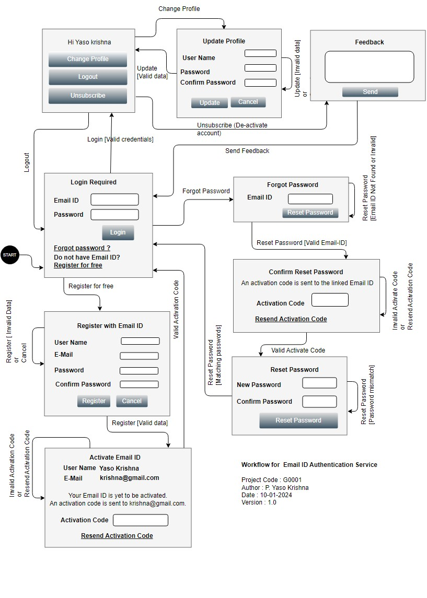

# Authentication Service #
Project Code: G0001

Authentication Service is part of User Authentication Infrastructure. It is built around [Shopping website cognito](https://aws.amazon.com/cognito/) User Pools and Identify Pools.

## Use Cases ##

### Use Case Diagram ###


## User Stories ##
### G0001-001: Register ###

* Actor: User without Email ID
* Pre Condition:

1. User should have a working email-id which is not already registered with Shopping website.

* Input:

1. Name of the User.
2. Working email id.
3. Preferred password with 8 characters (alphanumeric with at least one upper case and one lower case letter)

* Sequence:

1. User opens the webpage and click on 'Register'.
2. Registration page appears.
3. User supplies the name, a working email-id and the preferred password.
4. Page displays a message to check e-mail and prompts for activation code.
5. User enters the activation code.
6. Page displays success message and redirects to login page.

* Post Condition:

1. Page displays success message and the login page appears

* Exceptions:

1. Registration page re-appears with appropriate message if user enters invalid name or invalid email-ID or invalid password.
2. Registration page re-appears with appropriate message if the email-ID is already registered with Shopping website.
3. Registration page shows "resend" button, in case the activation code is not entered in the first 5 minutes after the mail has been sent.
4. Registration page will not show any special message if the email-ID is not reachable. It just prompts for activation code, as usual.

### G0001-002: Login with Inactive Glarimy-ID ###

* Actor: User with Inactive Email-ID

* Pre Condition:

1. User should have a registered Email ID and password with Shopping website.

* Input:

1. Email ID
2. Password

* Sequence:

1. User opens the webpage and click on ‘Login’
2. Login page appears
3. User supplies Email ID and password
4. Page indicates that the Email ID is yet to be activated.
4. Page displays a message to check email and prompt for activation code
5. User enters the activation code
6. Page displays success message and redirects to login page

* Post Condition:

1. Page displays a message ‘successfully activated and the login page appears

* Exceptions:

1. Login page re-appears with appropriate message if user enters invalid Email ID or password.
2. Prompt box re-appears with appropriate message if user enters invalid Activation Code.
3. Login page re-appears with appropriate message if user fails to enter valid Activation Code within 5 minutes.

### G0001-003: Login with Active Email ID ###

* Actor: User with Active Email ID 

* Pre Condition:

1. User should have activated the Email ID

* Input:

1. Email ID. 
2. Password.

* Sequence:
 
1. User opens login web page
2. User supplies his/her Email ID and Password
3. User click on login button
4. User home page appears

* Post Condition:

1. User home page appears with name of the user displayed.

* Exceptions:

1. Login page re-appears with appropriate message if user enters invalid Email ID or password.

### G0001-004 Reset Password ###

* Actor: User with Active Email ID 
 
* Pre Condition:

1. User should have an active Email ID with Shopping website.

* Input:

1. Email ID

* Sequence:

1. User opens login page.
2. User clicks on forgot password button.
3. User enters Email ID
4. Page prompts for new password and clicks on "Reset Password"
4. Page displays a message to check email and prompt for activation code
5. User enters the activation code
6. Page displays success message and redirects to login page

* Post Condition:

1. User should be able to login with new credentials

* Exceptions:

1. Login page re-appears with appropriate message if user enters invalid Email-ID.
2. Prompt box re-appears with appropriate message if user enters invalid activation code.

### G0001-005 Change Profile  ###

* Actor: User with Active Email ID

* Pre Condition:

1. User should have logged into Shopping website

* Input:

1. Name (optional)
2. Profile Pic with max size of 5KB in the formats of JPG/PNG(optional)
3. Phone Number (optional)
4. Permanent Address (optional)
5. Password (optional)

* Sequence:

1. User click on profile
2. Page displays the current profile of the user
3. User changes one or more details
4. Page displays "Save" button
5. User clicks on "Save" button
6. Page displays appropriate success message. 

* Post Condition:

1. User should be able to see updated profile

* Exceptions:

1. Displays error message in case an invalid password is entered
2. Displays error message in case invalid phone number is entered
3. Displays error message in case name is invalid
4. Displays error message in case invalid size/format for the profile pic

### G0001-006 Logout ###

* Actor: User with Active Email ID

* Pre Condition:

1. User should have logged in to working Email ID.

* Input:

1. None

* Sequence:

1. User click on Logout.
2. Page displays a message ‘successfully Logout ‘ and the login page appears.

* Post Condition:

1. Login screen appears
2. Back button or bookmarks fail to open any of the login-protected pages of the web app

* Exceptions:

1. Not Applicable

### G0001-007 De-activate Email-ID ###

* Actor: User with Active Email ID

* Pre Condition:

1. User should be logged in with Active Email ID.

* Input:

1. None

* Sequence:

1. User click on deactivate.
2. Page displays optional feedback prompt with reason (Not Useful | Expensive | Low Quality) for leaving. 
3. User enters/skips feedback.
4. Page displays a message ‘successfully deactivated’ and the login page appears.

* Post Condition:

1. User should not be able to login to Shopping website with activating the ID again.
2. Back button or bookmarks fail to open any of the login-protected pages of the web app

* Exceptions:

1. Not Applicable

## Workflow ##

### Workflow Diagram ###


## Development ##

### Dependencies ###
1. Nodejs 10+
2. Visual Studio Code

### How to run ###
1. Move to the 'app' folder
```
cd app
```
2. Install the dependencies
```
npm install
``` 
3. Run the app
```
npm start
```
4. Verify http://localhost:8081
